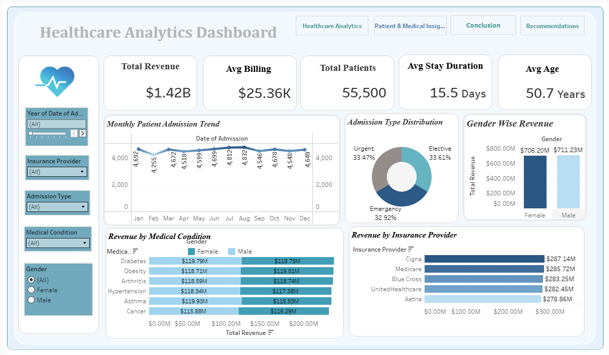
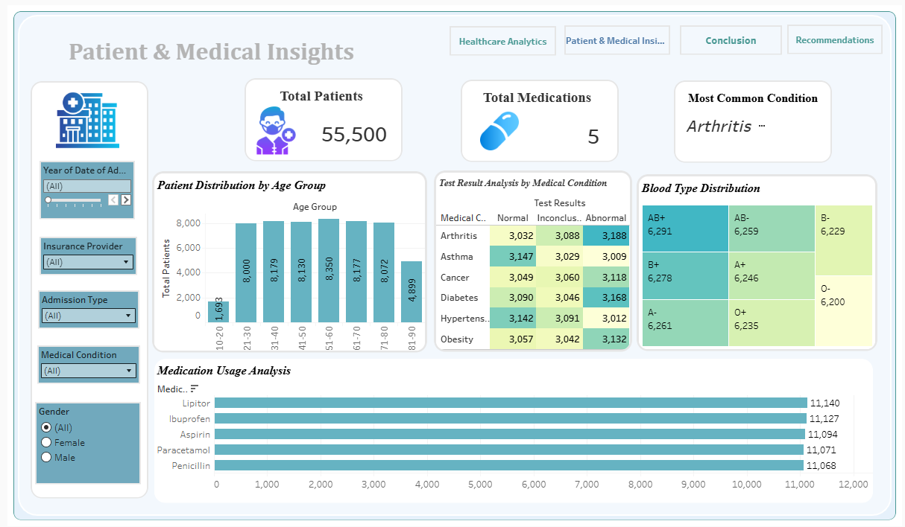

# 🏥 Healthcare Analytics Dashboard

<div align="center">

### 📊 Interactive Tableau Healthcare Intelligence Dashboard

Transforming raw healthcare data into actionable business insights through advanced analytics and visualization.


</div>

---

## 📌 Project Overview

The **Healthcare Analytics Dashboard** is a Tableau-based Business Intelligence solution designed to analyze healthcare data and generate meaningful insights related to patient demographics, revenue performance, medical conditions, and operational efficiency.

This dashboard supports healthcare organizations in making data-driven decisions that improve patient care, optimize resource allocation, and enhance overall organizational performance.

---

## 🎯 Problem Statement

Healthcare organizations often struggle with:

✔ Monitoring patient trends efficiently

✔ Tracking revenue performance

✔ Understanding medical condition patterns

✔ Managing healthcare resources effectively

✔ Making faster data-driven decisions

This project addresses these challenges through an interactive analytics dashboard.

---

## 🛠️ Tools & Technologies Used

| Tool | Purpose |
|--------|----------|
| 📊 Tableau | Dashboard Development |
| 📁 Excel / CSV | Data Source |
| 🧹 Data Cleaning | Data Preparation |
| 📈 Data Visualization | Insight Generation |
| 💻 GitHub | Project Documentation |

---

# 📷 Dashboard Preview

## 🏥 Healthcare Analytics Dashboard


### 📌 Dashboard Features

✔ Revenue Analysis

✔ Monthly Admission Trends

✔ Insurance Provider Performance

✔ Gender-wise Revenue Analysis

✔ Hospital Revenue Comparison

✔ Patient Distribution

---

## 👨‍⚕️ Patient & Medical Insights Dashboard



### 📌 Dashboard Features

✔ Age Group Analysis

✔ Medical Condition Analysis

✔ Medication Usage Trends

✔ Blood Group Distribution

✔ Test Result Analysis

---

# 📈 Key Performance Indicators (KPIs)

| KPI | Value |
|------|--------|
| 💰 Total Revenue | $1.42 Billion |
| 👥 Total Patients | 55,500 |
| 💵 Average Billing | $25.36K |
| 🏥 Average Stay Duration | 15.5 Days |
| 🎂 Average Age | 50.7 Years |

---

# 🔍 Key Insights

### 💰 Financial Insights

📌 Generated over **$1.417 Billion** in healthcare revenue

📌 **Cigna** and **Medicare** contributed approximately **40%** of total revenue

📌 Hospital revenue distribution indicates strong financial performance

---

### 👥 Patient Insights

📌 Age group **51–60 years** recorded the highest patient admissions

📌 Patient demographics show a concentration in middle-aged populations

📌 Healthcare demand increases significantly after age 50

---

### 🩺 Medical Insights

📌 **Arthritis** emerged as the most common medical condition

📌 Medication usage remained relatively stable across patient groups

📌 Blood type distribution showed balanced variation

---

### ⚙️ Operational Insights

📌 Emergency, Elective, and Urgent admissions remained balanced

📌 Stable admission patterns indicate operational consistency

---

# 🚀 Strategic Recommendations

✔ Strengthen partnerships with high-performing insurance providers

✔ Focus specialized care programs for high-risk medical conditions

✔ Improve resource allocation for high-admission age groups

✔ Develop predictive healthcare planning models

✔ Optimize medication procurement strategies

---

## 📂 Project Structure

```text
Healthcare-Analytics-Dashboard
│
├── Dashboard
│   └── Healthcare_Analytics.twbx
│
├── Dataset
│   └── healthcare_data.csv
│
├── Images
│   ├── Healthcare_Dashboard.png
│   └── Patient_Insights.png
│
└── README.md
```

---

## 🌟 Project Outcome

This dashboard converts complex healthcare data into an interactive decision-support system that enables:

✔ Faster decision-making

✔ Better patient care management

✔ Revenue optimization

✔ Improved operational efficiency

---

## 👩 Author

Shivani Padole

📊 Data Analyst | Tableau Developer  

---

## Live Dashboard

View Interactive Dashboard:
https://public.tableau.com/app/profile/shivani.padole/viz/HealthcareAnalyticsProject_17801282741810/HealthcareAnalyticsDashboard?publish=yes
<div align="center">

### ⭐ If you found this project useful, consider giving it a star ⭐

</div>
